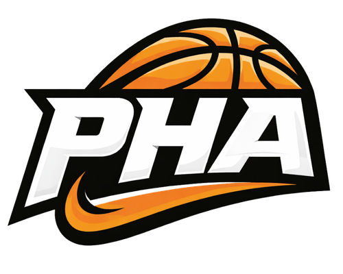

# 🏀 PHA — Project Hoops Academy

  

### Uma plataforma interativa sobre o universo do basquete

Sistema web desenvolvido para ensinar, informar e desafiar usuários através de conteúdos educativos, quiz interativo e dashboard de desempenho.

 

---

# 📌 Sobre o Projeto

O **PHA (Project Hoops Academy)** é uma plataforma web desenvolvida com o objetivo de compartilhar conhecimento sobre o basquete de maneira moderna, visual e interativa.

O sistema reúne informações históricas, regras oficiais, fundamentos do esporte e um quiz dinâmico que permite aos usuários testarem seus conhecimentos enquanto acompanham seu desempenho através da dashboard com estatísticas.

O projeto foi desenvolvido buscando unir:

- ensinamento
- design moderno
- interatividade
- experiência do usuário

---

# 🎯 Objetivo

O principal objetivo do projeto é transformar o aprendizado sobre basquete em uma experiência mais dinâmica e envolvente, permitindo que usuários aprendam enquanto interagem com a plataforma.

Além disso, o sistema também tem foco em:

- estimular o interesse pelo esporte
- praticar conceitos de desenvolvimento web
- aplicar análise de dados em dashboards
- desenvolver funcionalidades completas de front-end e back-end

---

# ✨ Funcionalidades

## 🏠 Landing Page Interativa

- Carrossel dinâmico
- Navegação por seções
- Conteúdo educativo sobre basquete

---

## 📚 Conteúdo Educacional

### 🏀 História do Basquete

- Origem do esporte
- Evolução histórica
- Chegada ao Brasil

### 📖 Regras do Jogo

- Tempo de partida
- Pontuação
- Faltas
- Lances livres
- Controle de bola

### ⛹️ Fundamentos

- Drible
- Passe
- Arremesso
- Rebote
- Bloqueio

---

## 🔐 Sistema de Usuário

- Cadastro
- Login
- Sessão autenticada
- Validação de usuário

---

## 🧠 Quiz Interativo

- Perguntas sobre basquete
- Sistema de pontuação
- Contagem de acertos e erros
- Feedback de desempenho

---

## 📊 Dashboard

- Histórico de tentativas
- Estatísticas do usuário
- Ranking
- Gráficos interativos com Chart.js
